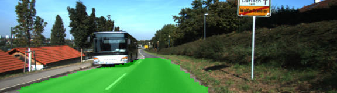

---
### PART 3: Sensor Fusion, Localization, and Control
### Project 2:  Semantic Segmentation

### Project Introduction

In  this project, I label the pixels of a road in images using a Fully Convolutional Network (FCN).

### Keywords
Fully Convolutional Network, Semantic Segmentation, Transfer Learning

### Steps
1. load the pretrained vgg model
2. learn the correct features from the images:
  - encoder: VGG16 model pretrained on ImageNet
  - decoder: upsample the results of encoder to the original image size
3. optimize the neural network
  - loss: cross entropy loss and regularization loss
  - optimizer: adam optimizer
4. train the neural network
  - epochs: 40
  - batch size: 16
  - learning rate: 0.001
  - keep probability: 0.5

### Tips for better labeling accuracy
1. use regularization for layers AND add regularization loss to the final loss
2. scale pooling layers 3 and 4 of vgg before feeding into the 1x1 convolutions

### Results

### Further improvement
1. fine tune hyperparameters
2. improve training and inference performance
